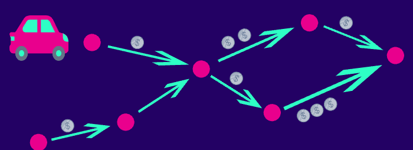
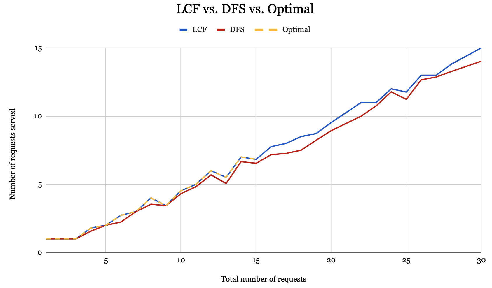

# dial-a-ride
Source code for the research on the Longest-Chain-First approach for the Dial-a-Ride problem
conducted by Bill Tran and Minh Nguyen at Connecticut College, supervised and consulted
by Professor Christine Chung, in the Fall 2022.

## Problem Description
### General Dial-a-Ride Problem
The Dial-a-Ride Problem (DARP) requires the scheduling of vehicle routes to satisfy a collection of pickup and delivery requests, or rides, where each ride originates at a source and terminates at a destination.
- Each request has a revenue and possibly some other constraints, like they must be served within a specified time window
- For most variants the goal is to find a schedule that will allow the vehicle(s) to serve requests within the constraints, while meeting a specified objective, such as maximizing the revenue
- Applications: the transport of both people and goods, including delivery services, ambulances, ride-sharing services, and paratransit services.

### Uniform Metric, Uniform Revenue
We studied the DARP with the following assumptions:
- Uniform metric: all rides have the same distance
- Uniform revenue: all rides have the same revenue of 1
- Only 1 driver/vehicle, can start at any location
- All requests are given in the beginning of the day and can be served in any order
within a time limit T

### Hardness
This problem is NP-hard, meaning that there is no polynomial-time algorithm that can solve it. [1]

## Longest-Chain-First Approach
### Overview
We studied an approach to the DARP that we call the Longest-Chain-First (LCF) approach. A chain is a sequence of requests
where the destination of any (non-final) request is source of the next.
The LCF approach finds the longest chain, serves that chain, removes it from the graph, and then repeats the process until time runs out or all requests have been served.
### Find the Longest Chain in a directed acyclic graph (DAG)
In order to find the longest chain in a graph, we use the Depth First Search, or DFS, algorithm in combination with Backtracking technique. How this algorithm is different from standard DFS is that instead of visiting nodes as in standard DFS, this algorithm visits “edges” in the graph and furthermore, it allows repeated visits to the same edges.

Implementation of this algorithm can be found here: [find_lc.py](./computation/find_lc.py)
### LCF Implementation
The LCF approach is implemented here: [find_lcf.py](./computation/find_lcf.py)

## Alternatives to LCF
### Brute-force Optimal
We also implemented a brute-force approach to find the optimal solution to the DARP.
It is done by generating the the permutations of all possible rides (order to serve) and then finding the permutation that maximizes the revenue.

Implementation: [find_opt.py](./computation/find_opt.py)
### DFS
We experimented another algorithm based on LCF which, instead of
DFS with backtracking, we eliminated backtracking, so this algorithm won't guarantee
to find a longest chain but it will be more efficient. This algorithm uses DFS to find the
longest chain it could see without backtracking, and visits each edge only once.

Implementation: [find_lc.py](./computation/find_lc.py) (find_longest_chain_no_removals)

## Simulations & Results
Scripts to run simulations can be found in the [simulation](./simulation) folder:
- [sync_simulation.py](./simulation/sync_simulation.py): run simulations synchronously
- [parallel_simulation.py](./simulation/parallel_simulation.py): run simulations in parallel with threads

Simulation data can be found in the [simulation-data](./simulation_data) folder with the following file name convention:
- `lcf_vs_dfs`: simulations of LCF compared to DFS
- `20k_7_10_8_10_8_10.txt`: 20,000 randomly generated instances, where the range of time limit is 7 to 10, nodes is 8 to 10, and edges is 8 to 10

## More on this topic
- [Our presentation](https://docs.google.com/presentation/d/1SK-6StupipZcgB4pLqL-DUJGJsXika9lVmJliMKKQAs/edit?usp=sharing)

## References
[1] Barbara M. Anthony, Ricky Birnbaum, Sara Boyd, Ananya Christman, Christine
Chung, Patrick Davis, Jigar Dhimar, and David Yuen. Maximizing the Number
of Rides Served for Dial-a-Ride.